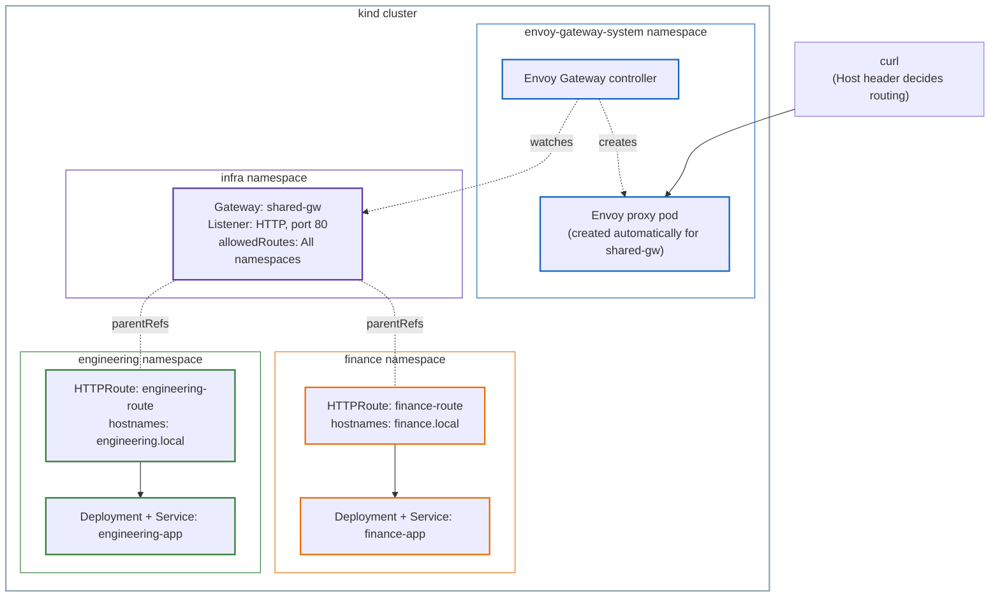

# Lab 1: Roles, Personas, and the Resource Model, Hands-On

This lab is the hands-on companion to [Part 1: Roles, Personas, and the Resource Model](../01-roles-personas-resource-model.md). Everything in that guide was explained with a fictional example. In this lab, we build that exact same scenario on a real Kubernetes cluster, with a real Gateway API controller, and show the real commands and real output at every step.

## The use case

A company has two application teams, Engineering and Finance, each running their own small web application. Neither team wants to manage their own load balancer, certificates, or entry point into the cluster. Instead, a platform team provisions **one shared Gateway**, and each application team attaches their own routing rules to it independently, without needing to coordinate with each other.

This isn't a made-up pattern for teaching purposes. It's a documented, real-world design:

- GitGuardian's own self-hosting documentation describes this exact setup: "You operate a multi-tenant cluster with a shared Gateway managed by a different team, and you want [the product]'s routes to attach to it rather than provisioning a dedicated entry point... Typical when a platform team operates one shared Gateway for many applications."
- A Microsoft Azure architecture write-up on Gateway API describes it the same way: "a single shared Gateway serves as the centralised entry point, while individual HTTPRoutes in each tenant's namespace define their own routing rules."

## Architecture



Notice that `GatewayClass` isn't shown as a box in the runtime path, it's a cluster-scoped template that the controller reads once, when `shared-gw` is created. It plays no role once the Envoy proxy pod exists.

## Step 1: Create the cluster

```bash
kind create cluster --name gwapi-lab-1
```

```
Creating cluster "gwapi-lab-1" ...
 ✓ Ensuring node image (kindest/node:v1.35.0) 🖼
 ✓ Preparing nodes 📦
 ✓ Writing configuration 📜
 ✓ Starting control-plane 🕹️
 ✓ Installing CNI 🔌
 ✓ Installing StorageClass 💾
Set kubectl context to "kind-gwapi-lab-1"
```

## Step 2: Ian's step, install Envoy Gateway (controller + Gateway API CRDs)

```bash
helm install eg oci://docker.io/envoyproxy/gateway-helm --version v1.9.1 -n envoy-gateway-system --create-namespace
```

This single command installs both the Gateway API CRDs (the schema for `Gateway`, `GatewayClass`, `HTTPRoute`) and the Envoy Gateway controller. At this point, nothing else exists yet, no proxy pod, no data plane, only the capability to understand and act on these resources.

```bash
kubectl get pods -A
```

```
envoy-gateway-system   eg-gateway-helm-certgen-k65sl                       0/1     Completed   0          33s
envoy-gateway-system   envoy-gateway-54b57d4f5-rm6tk                       1/1     Running     0          25s
```

Only the controller itself is running. The `certgen` job is a one-time setup task and is expected to show `Completed`.

## Step 3: Chihiro's step, create the namespaces

None of the three guide parts explicitly assign namespace creation to a persona, but it fits Chihiro's role, "typically concerned with policies, network access, application permissions." In most real clusters, application teams (Ana) don't have permission to create namespaces themselves, that's cluster-level access, usually held by whoever plays Chihiro's role.

```bash
kubectl create namespace engineering
kubectl create namespace finance
kubectl create namespace infra
```

```
namespace/engineering created
namespace/finance created
namespace/infra created
```

## Step 4: Ian's step, the GatewayClass

```bash
cat <<EOF | kubectl apply -f -
apiVersion: gateway.networking.k8s.io/v1
kind: GatewayClass
metadata:
  name: eg
spec:
  controllerName: gateway.envoyproxy.io/gatewayclass-controller
EOF
```

```bash
kubectl get gatewayclass eg
```

```
NAME   CONTROLLER                                      ACCEPTED   AGE
eg     gateway.envoyproxy.io/gatewayclass-controller   True       7s
```

## Step 5: Ana's step, deploy the two teams' applications

In a real company, the Engineering and Finance teams would have written these applications themselves. This lab uses a pre-built public image (`http-echo`) instead, to skip the application development step and focus purely on the Gateway API configuration.

We use `hashicorp/http-echo:1.0.0`, a tiny web server that returns a fixed piece of text, so it's easy to tell which app answered a request.

### Engineering's app

```bash
cat <<EOF | kubectl apply -f -
apiVersion: apps/v1
kind: Deployment
metadata:
  name: engineering-app
  namespace: engineering
spec:
  replicas: 1
  selector:
    matchLabels:
      app: engineering-app
  template:
    metadata:
      labels:
        app: engineering-app
    spec:
      containers:
        - name: http-echo
          image: hashicorp/http-echo:1.0.0
          args:
            - "-text=Hello from Engineering"
---
apiVersion: v1
kind: Service
metadata:
  name: engineering-app
  namespace: engineering
spec:
  selector:
    app: engineering-app
  ports:
    - port: 8080
      targetPort: 5678
EOF
```

### Finance's app

```bash
cat <<EOF | kubectl apply -f -
apiVersion: apps/v1
kind: Deployment
metadata:
  name: finance-app
  namespace: finance
spec:
  replicas: 1
  selector:
    matchLabels:
      app: finance-app
  template:
    metadata:
      labels:
        app: finance-app
    spec:
      containers:
        - name: http-echo
          image: hashicorp/http-echo:1.0.0
          args:
            - "-text=Hello from Finance"
---
apiVersion: v1
kind: Service
metadata:
  name: finance-app
  namespace: finance
spec:
  selector:
    app: finance-app
  ports:
    - port: 8080
      targetPort: 5678
EOF
```

```bash
kubectl get pods -n engineering
kubectl get pods -n finance
```

```
NAME                              READY   STATUS    RESTARTS   AGE
engineering-app-76bfd7d7d-b8j8l   1/1     Running   0          39s

NAME                           READY   STATUS    RESTARTS   AGE
finance-app-5f94df9bc6-g4lfd   1/1     Running   0          39s
```

## Step 6: Chihiro's step, the shared Gateway

```bash
cat <<EOF | kubectl apply -f -
apiVersion: gateway.networking.k8s.io/v1
kind: Gateway
metadata:
  name: shared-gw
  namespace: infra
spec:
  gatewayClassName: eg
  listeners:
    - name: http
      protocol: HTTP
      port: 80
      allowedRoutes:
        namespaces:
          from: All
EOF
```

`allowedRoutes.namespaces.from: All` is required here. Engineering's and Finance's Routes will live in their own namespaces, not `infra`, so the default (`Same`) would silently reject them both.

```bash
kubectl get gateway shared-gw -n infra
```

```
NAME        CLASS   ADDRESS   PROGRAMMED   AGE
shared-gw   eg                False        55s
```

`PROGRAMMED: False` here doesn't mean something is broken. `kubectl describe gateway shared-gw -n infra` confirms the actual reason:

```
Reason:                AddressNotAssigned
Message:               No addresses have been assigned to the Gateway
```

`kind` clusters have no cloud provider, so a `LoadBalancer`-type Service (which is what Envoy Gateway provisions for each Gateway) never receives an external IP. This is expected in a local lab and doesn't stop the Gateway from actually working, as the rest of this lab shows.

## Step 7: See what the controller actually created

Notice this doesn't live in the `infra` namespace, it lives alongside the controller itself:

```bash
kubectl get pods -n envoy-gateway-system
kubectl get svc -n envoy-gateway-system
```

```
NAME                                             READY   STATUS    RESTARTS   AGE
envoy-gateway-54b57d4f5-rm6tk                    1/1     Running   0          117m
envoy-infra-shared-gw-201b3ab5-9f9b97f9c-l42h8   2/2     Running   0          2m59s

NAME                             TYPE           CLUSTER-IP      EXTERNAL-IP   PORT(S)          AGE
envoy-gateway                    ClusterIP      10.96.128.230   <none>        ...              117m
envoy-infra-shared-gw-201b3ab5   LoadBalancer   10.96.192.196   <pending>     80:32415/TCP     2m59s
```

The moment `shared-gw` was created, Envoy Gateway automatically provisioned a real Envoy proxy pod and a matching Service for it. The `EXTERNAL-IP` stays `<pending>` for the reason explained above, but every `LoadBalancer` Service also gets a `NodePort` automatically (`32415` here), which is enough to reach it locally.

## Step 8: Port-forward to the generated Service

```bash
kubectl port-forward -n envoy-gateway-system svc/envoy-infra-shared-gw-201b3ab5 8080:80
```

```
Forwarding from 127.0.0.1:8080 -> 10080
Forwarding from [::1]:8080 -> 10080
```

Leave this running in its own terminal for the rest of the lab.

## Step 9: Ana's step, each team's own HTTPRoute

```bash
cat <<EOF | kubectl apply -f -
apiVersion: gateway.networking.k8s.io/v1
kind: HTTPRoute
metadata:
  name: engineering-route
  namespace: engineering
spec:
  parentRefs:
    - name: shared-gw
      namespace: infra
  hostnames:
    - "engineering.local"
  rules:
    - backendRefs:
        - name: engineering-app
          port: 8080
EOF
```

```bash
cat <<EOF | kubectl apply -f -
apiVersion: gateway.networking.k8s.io/v1
kind: HTTPRoute
metadata:
  name: finance-route
  namespace: finance
spec:
  parentRefs:
    - name: shared-gw
      namespace: infra
  hostnames:
    - "finance.local"
  rules:
    - backendRefs:
        - name: finance-app
          port: 8080
EOF
```

## Step 10: Test both hostnames

```bash
curl -H "Host: engineering.local" http://localhost:8080/
```

```
Hello from Engineering
```

```bash
curl -H "Host: finance.local" http://localhost:8080/
```

```
Hello from Finance
```

Same Gateway, same port, same IP, two completely different destinations, decided purely by the `Host` header.

## End-to-end request flow

Here's exactly what happens for `curl -H "Host: engineering.local" http://localhost:8080/`:

1. `curl` sends the request to `localhost:8080`. `kubectl port-forward` tunnels it to port 80 on the generated Service, `envoy-infra-shared-gw-201b3ab5`.
2. The Service (which does no processing of its own) forwards it to the actual Envoy proxy pod, `envoy-infra-shared-gw-...-l42h8`.
3. Envoy checks which Listener the request matches. There's only one, `http`, on port 80, so this is immediate.
4. Envoy checks `allowedRoutes`. Since it's set to `All`, Routes from `engineering` and `finance` are both eligible.
5. Envoy checks the `Host` header (`engineering.local`) against the `hostnames` field of every Route attached to this Listener. `engineering-route` matches, `finance-route` doesn't.
6. `engineering-route`'s rule has no `matches` block, so it applies unconditionally, and points to `backendRefs: engineering-app, port 8080`.
7. Envoy forwards the request to the `engineering-app` Service, in the `engineering` namespace.
8. That Service sends it to whichever `engineering-app` Pod is currently running, on port `5678` (where `http-echo` listens).
9. `http-echo` returns its fixed text, and the response travels back through the same chain to `curl`.

Notice `GatewayClass` never appears in this per-request flow. Its only job was earlier, at creation time, telling the controller which software should build `shared-gw` in the first place.

## Who did what, mapped to the personas

| Step | Task | Persona |
|---|---|---|
| Step 2 | Install Envoy Gateway (controller + CRDs) | Ian |
| Step 3 | Create the namespaces | Chihiro |
| Step 4 | Create the `GatewayClass` | Ian |
| Step 5 | Deploy the applications | Ana (once per team) |
| Step 6 | Create the shared `Gateway` | Chihiro |
| Step 9 | Create the `HTTPRoute`s | Ana (once per team) |

## Cleanup

```bash
kind delete cluster --name gwapi-lab-1
```
