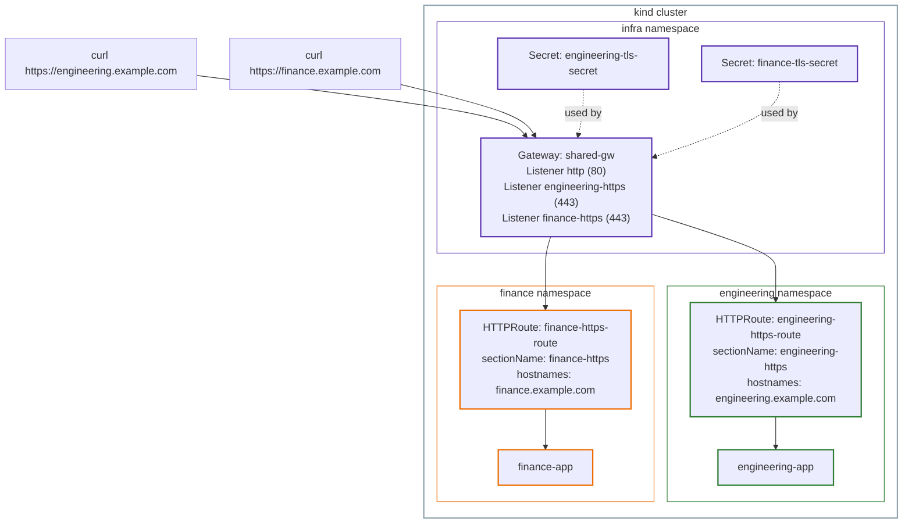

# Lab 2: GatewayClass and Gateway, In Depth, Hands-On

This lab is the hands-on companion to [Part 2: GatewayClass and Gateway, In Depth](../02-gatewayclass-and-gateway-in-depth.md). It continues directly from [Lab 1](01-roles-resource-model-lab.md), on the same cluster, with `shared-gw` already carrying one plain HTTP listener and the Engineering and Finance apps already running.

## The use case

Engineering and Finance are happy sharing one Gateway, but now each wants **their own domain and their own TLS certificate**, without asking the platform team to manage that certificate for them.

This is a documented, real-world requirement, not a made-up teaching scenario. NGINX Gateway Fabric's own GitHub roadmap describes this exact need as a user story:

> "As an application developer I want to create an HTTPS listener on a shared gateway with my team's custom TLS certificate so that my application can serve HTTPS traffic on my team's domain without needing platform team approval."

The official Kubernetes Gateway API v1.5 release blog shows the same pattern in its own example: a shared Gateway in one namespace, with separate teams each attaching their own HTTPS listener, hostname, and certificate.

## Architecture (final, working state)



Notice both TLS secrets live in `infra`, the Gateway's own namespace, not in `engineering` or `finance`. This is the same default-namespace rule from Part 1, now applied to `certificateRefs` instead of `parentRefs`.

## Step 1: Ana's step, generate two TLS certificates

In a real company, each team would generate their own certificate for their own domain, the whole point of the real-world need cited above is that Ana wants control over her own certificate. We don't have real domains, so we generate our own self-signed certificates, one per team, just to have something real to put in the required `certificateRefs` field.

```bash
openssl req -x509 -newkey rsa:2048 -nodes -keyout engineering.key -out engineering.crt -days 365 -subj "/CN=engineering.example.com"
```

```bash
openssl req -x509 -newkey rsa:2048 -nodes -keyout finance.key -out finance.crt -days 365 -subj "/CN=finance.example.com"
```

Both commands print a stream of `+` characters while generating randomness, then finish with `-----`, no other output needed.

## Step 2: Chihiro's step, create the Secrets in the Gateway's namespace

Even though the certificates belong to Engineering and Finance, Chihiro is the one who has to place them, since `shared-gw` can only reference Secrets in its own namespace, `infra`. This is worth noticing: right now, every team's certificate has to pass through Chihiro to get placed correctly. Lab 6, on `ListenerSet`, comes back to exactly this friction point.

```bash
kubectl create secret tls engineering-tls-secret --cert=engineering.crt --key=engineering.key -n infra
kubectl create secret tls finance-tls-secret --cert=finance.crt --key=finance.key -n infra
```

```
secret/engineering-tls-secret created
secret/finance-tls-secret created
```

Both secrets are created in `infra`, not `engineering` or `finance`. A `Gateway`'s `certificateRefs` can only point to a Secret in its own namespace by default (the same rule that governs `parentRefs` in Part 1), so the location is decided by where `shared-gw` lives, not by which team the certificate belongs to.

## Step 3: Chihiro's step, add two HTTPS listeners to shared-gw

```bash
cat <<EOF | kubectl apply -f -
apiVersion: gateway.networking.k8s.io/v1
kind: Gateway
metadata:
  name: shared-gw
  namespace: infra
spec:
  gatewayClassName: eg
  listeners:
    - name: http
      protocol: HTTP
      port: 80
      allowedRoutes:
        namespaces:
          from: All
    - name: engineering-https
      protocol: HTTPS
      port: 443
      hostname: "engineering.example.com"
      tls:
        mode: Terminate
        certificateRefs:
          - name: engineering-tls-secret
      allowedRoutes:
        namespaces:
          from: All
    - name: finance-https
      protocol: HTTPS
      port: 443
      hostname: "finance.example.com"
      tls:
        mode: Terminate
        certificateRefs:
          - name: finance-tls-secret
      allowedRoutes:
        namespaces:
          from: All
EOF
```

The original `http` listener from Lab 1 is kept, not removed, so the existing hostnames from that lab keep working too.

## Step 4: Verify the Gateway accepted all three listeners

```bash
kubectl describe gateway shared-gw -n infra
```

The relevant part of the output:

```
Listeners:
  Attached Routes:  2
  Conditions:
    Reason:  Accepted
    Status:  True
    Type:    Accepted
  Name:      http
  ...
  Attached Routes:  0
  Conditions:
    Reason:  Accepted
    Status:  True
    Type:    Accepted
  Name:      engineering-https
  ...
  Attached Routes:  0
  Conditions:
    Reason:  Accepted
    Status:  True
    Type:    Accepted
  Name:      finance-https
```

All three listeners show `Accepted: True`, no conflict, since `engineering-https` and `finance-https` have different `hostname` values on the same port. Also notice `Attached Routes: 0` on both new listeners, that's expected, since no `HTTPRoute` targets them yet. Once Ana creates the HTTPRoutes in Step 6, this number becomes 1 for each.

## Step 5: Confirm the new port on the generated Service

```bash
kubectl get svc -n envoy-gateway-system
```

```
NAME                             TYPE           CLUSTER-IP      EXTERNAL-IP   PORT(S)
envoy-infra-shared-gw-201b3ab5   LoadBalancer   10.96.192.196   <pending>     80:32415/TCP,443:31196/TCP
```

The same Service and the same Envoy proxy Pod from Lab 1 now expose port 443 as well, alongside port 80.

## Step 6: Ana's step, create HTTPRoutes for the new listeners

A new Listener doesn't automatically attach any existing Route to it. `engineering-route` and `finance-route` from Lab 1 have `hostnames: engineering.local` and `finance.local`, which don't match the new listeners' hostnames at all. Each team needs a new `HTTPRoute` that explicitly targets its own listener, using `sectionName`.

```bash
cat <<EOF | kubectl apply -f -
apiVersion: gateway.networking.k8s.io/v1
kind: HTTPRoute
metadata:
  name: engineering-https-route
  namespace: engineering
spec:
  parentRefs:
    - name: shared-gw
      namespace: infra
      sectionName: engineering-https
  hostnames:
    - "engineering.example.com"
  rules:
    - backendRefs:
        - name: engineering-app
          port: 8080
EOF
```

```bash
cat <<EOF | kubectl apply -f -
apiVersion: gateway.networking.k8s.io/v1
kind: HTTPRoute
metadata:
  name: finance-https-route
  namespace: finance
spec:
  parentRefs:
    - name: shared-gw
      namespace: infra
      sectionName: finance-https
  hostnames:
    - "finance.example.com"
  rules:
    - backendRefs:
        - name: finance-app
          port: 8080
EOF
```

`sectionName` is new here, it wasn't needed in Lab 1 because there was only one listener to attach to. With three listeners now on `shared-gw`, `sectionName` tells each Route exactly which one it's targeting.

Checking the Gateway again confirms the prediction from Step 4:

```bash
kubectl describe gateway shared-gw -n infra
```

```
Attached Routes:  1
...
Name:                    engineering-https
...
Attached Routes:  1
...
Name:                    finance-https
```

Both listeners now show `Attached Routes: 1`, exactly one each, matching the one `HTTPRoute` just created for it.

## Step 7: Port-forward to the new port

```bash
kubectl port-forward -n envoy-gateway-system svc/envoy-infra-shared-gw-201b3ab5 8443:443
```

Leave this running in its own terminal.

## Step 8: Test both hostnames over HTTPS

```bash
curl -k --resolve engineering.example.com:8443:127.0.0.1 https://engineering.example.com:8443/
```

```
Hello from Engineering
```

```bash
curl -k --resolve finance.example.com:8443:127.0.0.1 https://finance.example.com:8443/
```

```
Hello from Finance
```

## A note on inspecting a specific HTTPRoute

To see the full YAML for one specific Route, name it directly:

```bash
kubectl get httproute engineering-https-route -n engineering -o yaml
```

This includes the `status.parents.conditions` block, which is the fastest way to confirm a Route was actually accepted by the Gateway:

```
status:
  parents:
  - conditions:
    - reason: Accepted
      status: "True"
      type: Accepted
    - reason: ResolvedRefs
      status: "True"
      type: ResolvedRefs
```

To just see what exists in a namespace without the full detail, drop `-o yaml` and use the plain list instead:

```bash
kubectl get httproute -n finance
```

```
NAME                  HOSTNAMES                 AGE
finance-https-route   ["finance.example.com"]   6m
finance-route         ["finance.local"]         7h27m
```

## End-to-end request flow

For `curl -k --resolve engineering.example.com:8443:127.0.0.1 https://engineering.example.com:8443/`:

1. The TLS handshake begins. The client's ClientHello includes the SNI, `engineering.example.com`, sent before anything is encrypted.
2. Envoy has two listeners on port 443, `engineering-https` and `finance-https`. It compares the SNI against each one's `hostname` and selects `engineering-https`, since that's the match.
3. Envoy completes the handshake using `engineering-tls-secret`, the certificate tied to that specific listener.
4. Now decrypted, Envoy reads the actual HTTP request and checks the Host header (also `engineering.example.com`) against the Routes attached to this listener. `engineering-https-route` matches, because its `sectionName` explicitly ties it to `engineering-https`, and its `hostnames` field matches too.
5. The request is forwarded to `engineering-app`, on port 8080, and the response travels back through the same TLS session.

The listener selection (step 2) and the Route matching (step 4) are two separate checks, using two different pieces of information, the SNI decides which certificate gets used, and the Host header (checked after decryption) decides which backend gets the request.

## Who did what, mapped to the personas

| Step | Task | Persona |
|---|---|---|
| Step 1 | Generate the TLS certificates | Ana (once per team) |
| Step 2 | Create the Secrets in `infra` | Chihiro |
| Step 3 | Add the HTTPS listeners to `shared-gw` | Chihiro |
| Step 6 | Create the HTTPRoutes | Ana (once per team) |

Notice Chihiro is now doing more work than in Lab 1, she has to place every team's certificate herself, and edit the shared Gateway every time a team needs a new listener. This bottleneck is exactly what motivates `ListenerSet`, covered in Lab 6.

## What we didn't cover in this lab

Part 2 also explains what happens when two Listeners become genuinely indistinguishable, for example, if both HTTPS listeners lost their `hostname` field, leaving them with the same `protocol` and `port` and nothing to tell them apart. We didn't trigger that conflict in this lab, but you can try it yourself by removing the `hostname` line from both listeners in Step 3 and re-running `kubectl describe gateway shared-gw -n infra` to see the `Conflicted: True` status Part 2 describes.

## Cleanup

```bash
kind delete cluster --name gwapi-lab-1
```
