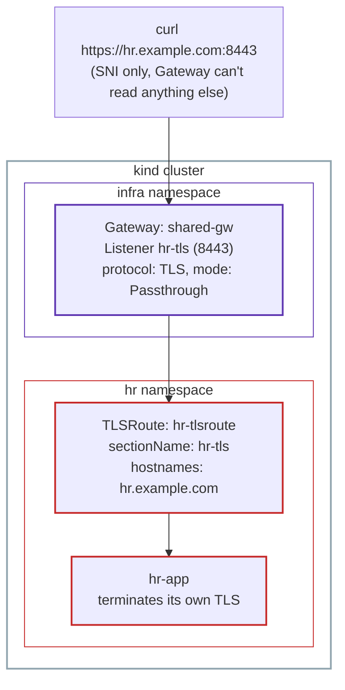

# Lab 2b: TLS Passthrough, TLSRoute, and the Addresses Field, Hands-On

This lab is a companion to [Part 1](../01-roles-personas-resource-model.md) and [Part 2](../02-gatewayclass-and-gateway-in-depth.md). It continues directly from [Lab 2](02-gatewayclass-gateway-lab.md), on the same cluster, and covers two pieces that guide neither Lab 1 nor Lab 2 demonstrated hands-on: `TLSRoute` with `Passthrough` mode, and the `addresses` field.

## The use case

Engineering and Finance are happy letting `shared-gw` decrypt their traffic (`Terminate` mode). HR has a different requirement: their backend needs to keep full control of its own encryption, the Gateway should never see the decrypted traffic at all.

Part 1 describes exactly this need: `TLSRoute` in `Passthrough` mode is "often used for things like databases, where the backend itself handles the encryption."

## Architecture



Unlike `engineering-https` and `finance-https`, the `hr-tls` Listener has no `certificateRefs` at all. The Gateway never decrypts this traffic, so it has no certificate to decrypt it with.

## Step 1: Ana's step, deploy HR's own backend

HR's app needs to terminate its own TLS. We use `ghcr.io/mendhak/http-https-echo:41`, a small server that ships with its own self-signed certificate and serves HTTPS out of the box, and is published for `linux/arm64` as well as `amd64`.

```bash
kubectl create namespace hr
```

```bash
cat <<EOF | kubectl apply -f -
apiVersion: apps/v1
kind: Deployment
metadata:
  name: hr-app
  namespace: hr
spec:
  replicas: 1
  selector:
    matchLabels:
      app: hr-app
  template:
    metadata:
      labels:
        app: hr-app
    spec:
      containers:
        - name: http-https-echo
          image: ghcr.io/mendhak/http-https-echo:41
          ports:
            - containerPort: 8443
---
apiVersion: v1
kind: Service
metadata:
  name: hr-app
  namespace: hr
spec:
  selector:
    app: hr-app
  ports:
    - port: 8443
      targetPort: 8443
EOF
```

```bash
kubectl get pods -n hr
```

```
NAME                    READY   STATUS    RESTARTS   AGE
hr-app-b95bdfd6-cmzxz   1/1     Running   0          29s
```

## Step 2: Chihiro's step, add a TLS Passthrough listener

```bash
cat <<EOF | kubectl apply -f -
apiVersion: gateway.networking.k8s.io/v1
kind: Gateway
metadata:
  name: shared-gw
  namespace: infra
spec:
  gatewayClassName: eg
  listeners:
    - name: http
      protocol: HTTP
      port: 80
      allowedRoutes:
        namespaces:
          from: All
    - name: engineering-https
      protocol: HTTPS
      port: 443
      hostname: "engineering.example.com"
      tls:
        mode: Terminate
        certificateRefs:
          - name: engineering-tls-secret
      allowedRoutes:
        namespaces:
          from: All
    - name: finance-https
      protocol: HTTPS
      port: 443
      hostname: "finance.example.com"
      tls:
        mode: Terminate
        certificateRefs:
          - name: finance-tls-secret
      allowedRoutes:
        namespaces:
          from: All
    - name: hr-tls
      protocol: TLS
      port: 8443
      hostname: "hr.example.com"
      tls:
        mode: Passthrough
      allowedRoutes:
        namespaces:
          from: All
        kinds:
          - kind: TLSRoute
EOF
```

Notice `protocol: TLS`, not `HTTPS`. This matters: `HTTPS` always implies the Gateway will terminate the connection. `TLS` is the protocol value used for Passthrough.

## Step 3: Verify the listener, and what it will accept

```bash
kubectl describe gateway shared-gw -n infra
```

The relevant part of the output:

```
Attached Routes:  0
...
Name:                    hr-tls
Supported Kinds:
  Group:  gateway.networking.k8s.io
  Kind:   TLSRoute
```

Two things worth noting. `Attached Routes: 0` is expected, no Route targets this listener yet. And `Supported Kinds` lists only `TLSRoute`, not `HTTPRoute`. This isn't something we configured directly, it's the Gateway API's own protocol compatibility rule: an `HTTPRoute` needs readable content to do path or header matching, which a `TLS`-protocol listener in `Passthrough` mode can never provide, so it's excluded automatically.

## Step 4: Ana's step, create the TLSRoute

```bash
cat <<EOF | kubectl apply -f -
apiVersion: gateway.networking.k8s.io/v1
kind: TLSRoute
metadata:
  name: hr-tlsroute
  namespace: hr
spec:
  parentRefs:
    - name: shared-gw
      namespace: infra
      sectionName: hr-tls
  hostnames:
    - "hr.example.com"
  rules:
    - backendRefs:
        - name: hr-app
          port: 8443
EOF
```

Notice there's no `matches` field here at all, unlike `HTTPRoute`. `TLSRoute` can only match on hostname, it has no way to inspect a path or a header.

Checking the Gateway again confirms the Route attached:

```bash
kubectl describe gateway shared-gw -n infra
```

```
Attached Routes:  1
...
Name:                    hr-tls
```

## Step 5: Port-forward and test

```bash
kubectl port-forward -n envoy-gateway-system svc/envoy-infra-shared-gw-201b3ab5 9443:8443
```

```bash
curl -k --resolve hr.example.com:9443:127.0.0.1 https://hr.example.com:9443/
```

```json
{
  "path": "/",
  "headers": {
    "host": "hr.example.com:9443"
  },
  "protocol": "https",
  "hostname": "hr.example.com",
  "os": {
    "hostname": "hr-app-b95bdfd6-cmzxz"
  },
  "connection": {
    "servername": "hr.example.com"
  },
  "clientCertificate": {}
}
```

This response is the proof that passthrough actually happened. `"protocol": "https"` and `"connection": {"servername": "hr.example.com"}` are reported by `hr-app` itself, meaning `hr-app` is the one that saw and terminated the TLS handshake, including the SNI, not `shared-gw`. And `"os": {"hostname": "hr-app-..."}` confirms the response came directly from HR's own Pod. If `shared-gw` had terminated this connection instead, none of this TLS-level detail would have reached `hr-app` at all.

## Step 6: The addresses field

Quick recap of what this field actually is, and why anyone would want it. By default, a `Gateway`'s Service gets a random IP assigned to it. That's normally fine, but imagine a company's security team has a firewall rule like "only allow traffic from IP `203.0.113.10`," or a DNS record that always points to that one IP. If the `Gateway` ever gets deleted and recreated (an upgrade, a migration, anything), a new random IP would break both the firewall rule and the DNS record. `addresses` solves this: it asks the `Gateway` to always use one specific IP, so it stays the same no matter how many times the `Gateway` is recreated.

Every Gateway so far in this lab has shown `Programmed: False`, with `Reason: AddressNotAssigned`, since `kind` has no cloud provider to hand out a real IP on its own. The `addresses` field lets us request a specific one instead of waiting for one to be assigned.

```bash
cat <<EOF | kubectl apply -f -
apiVersion: gateway.networking.k8s.io/v1
kind: Gateway
metadata:
  name: shared-gw
  namespace: infra
spec:
  gatewayClassName: eg
  addresses:
    - type: IPAddress
      value: "203.0.113.10"
  listeners:
    - name: http
      protocol: HTTP
      port: 80
      allowedRoutes:
        namespaces:
          from: All
    - name: engineering-https
      protocol: HTTPS
      port: 443
      hostname: "engineering.example.com"
      tls:
        mode: Terminate
        certificateRefs:
          - name: engineering-tls-secret
      allowedRoutes:
        namespaces:
          from: All
    - name: finance-https
      protocol: HTTPS
      port: 443
      hostname: "finance.example.com"
      tls:
        mode: Terminate
        certificateRefs:
          - name: finance-tls-secret
      allowedRoutes:
        namespaces:
          from: All
    - name: hr-tls
      protocol: TLS
      port: 8443
      hostname: "hr.example.com"
      tls:
        mode: Passthrough
      allowedRoutes:
        namespaces:
          from: All
        kinds:
          - kind: TLSRoute
EOF
```

```bash
kubectl describe gateway shared-gw -n infra
```

```
Status:
  Addresses:
    Type:   IPAddress
    Value:  203.0.113.10
  Conditions:
    Message: Address assigned to the Gateway, 1/1 envoy replicas available
    Reason:  Programmed
    Status:  True
    Type:    Programmed
```

`Programmed` flipped to `True`. `203.0.113.10` is a value from a documentation-only IP range (RFC 5737), it was never going to be real or routable. Envoy Gateway accepted the value we gave it and reported success, without ever checking whether it was reachable.

```bash
curl -k --max-time 5 https://203.0.113.10/
```

```
curl: (28) Connection timed out after 5004 milliseconds
```

This is the lesson worth keeping: `Programmed: True` here only means the controller recorded the address we asked for. It says nothing about whether that address actually works. In a real environment, this field is meant to be paired with an address you already own and control (an Elastic IP, a static IP reservation), so this gap between "recorded" and "reachable" would normally never surface, the address would genuinely resolve because it was real to begin with.

## End-to-end request flow (TLS Passthrough)

For `curl -k --resolve hr.example.com:9443:127.0.0.1 https://hr.example.com:9443/`:

1. The client starts a TLS handshake. The ClientHello includes the SNI, `hr.example.com`, sent before anything is encrypted.
2. Envoy checks the SNI against `hr-tls`'s `hostname`. It matches.
3. Because `hr-tls` is in `Passthrough` mode, Envoy does not attempt to decrypt anything. It looks at `hr-tlsroute`, confirms it's attached to this exact listener, and forwards the still-encrypted TCP stream to `hr-app`, on port 8443.
4. `hr-app` itself performs the TLS handshake, using its own built-in certificate, and only then reads the actual HTTP request underneath.
5. `hr-app`'s response travels back through the same encrypted connection, untouched by `shared-gw` the entire way.

Compare this to `engineering-https` from Lab 2: there, Envoy performs the handshake itself, decrypts, and only then looks for a matching `HTTPRoute`. Here, Envoy never gets far enough to decrypt anything, the SNI is the only information it ever sees.

## Who did what, mapped to the personas

| Step | Task | Persona |
|---|---|---|
| Step 1 | Deploy HR's backend | Ana |
| Step 2 | Add the `hr-tls` Passthrough listener | Chihiro |
| Step 4 | Create the `TLSRoute` | Ana |
| Step 6 | Request a specific address | Chihiro |

## Cleanup

```bash
kind delete cluster --name gwapi-lab-1
```
