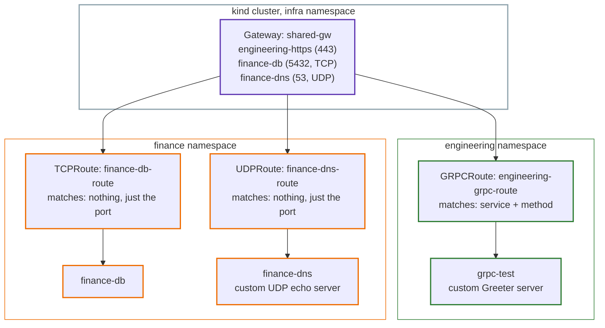

# Lab 3: Route Types, In Depth, Hands-On

This lab is the hands-on companion to [Part 3: Route Types, In Depth](../03-route-types-in-depth.md). It continues directly from [Lab 2](02-gatewayclass-gateway-lab.md), on the same cluster. `HTTPRoute` was already covered in Lab 1, and `TLSRoute` in Lab 2b, so this lab focuses on the three that haven't been demonstrated hands-on yet: `GRPCRoute`, `TCPRoute`, and `UDPRoute`.

## Why these three need their own Route kind

Every Route type can see a different amount of the traffic passing through it. This lab makes that concrete, with three real backends that each need a different amount of visibility.

| Route kind | What kind of traffic | What it can match on | Real-world example |
|---|---|---|---|
| `GRPCRoute` | gRPC (usually backend-to-backend) | Service name and method name | A microservice calling another microservice's API |
| `TCPRoute` | Raw TCP | Nothing but the port it arrived on | A database connection |
| `UDPRoute` | Raw UDP | Nothing but the port it arrived on | A DNS query |

## Architecture



## Part 1: GRPCRoute

### What gRPC is, and why it needs its own Route kind

gRPC is a way for services to talk to each other, usually **backend-to-backend** (one microservice calling another), rather than normal website traffic.

Two differences from `HTTPRoute` matter here. First, gRPC requests are in binary (protobuf) format, not plain text like HTTP, so a normal `curl` can't read them, a tool called `grpcurl` is needed instead. Second, `HTTPRoute` matches on a URL path (`/api`), but gRPC calls are matched by **service name and method name** (like "the `Greeter` service's `SayHello` method"). `GRPCRoute` exists specifically to match on that.

### A note on the test server used here

This lab uses a small, custom-built gRPC server, so the exact service and method name are known with certainty.

The server implements the standard `Greeter` service with one method, `SayHello`, this is the canonical example used throughout the gRPC ecosystem.

`helloworld.proto`:
```proto
syntax = "proto3";

package helloworld;

service Greeter {
  rpc SayHello (HelloRequest) returns (HelloReply) {}
}

message HelloRequest {
  string name = 1;
}

message HelloReply {
  string message = 1;
}
```

`server.py`:
```python
from concurrent import futures
import grpc
import helloworld_pb2
import helloworld_pb2_grpc


class Greeter(helloworld_pb2_grpc.GreeterServicer):
    def SayHello(self, request, context):
        return helloworld_pb2.HelloReply(message=f"Hello, {request.name}! This is Engineering's OrderService.")


def serve():
    server = grpc.server(futures.ThreadPoolExecutor(max_workers=10))
    helloworld_pb2_grpc.add_GreeterServicer_to_server(Greeter(), server)
    server.add_insecure_port("[::]:9000")
    server.start()
    print("Greeter server listening on port 9000")
    server.wait_for_termination()


if __name__ == "__main__":
    serve()
```

`Dockerfile`:
```dockerfile
FROM python:3.12-slim
WORKDIR /app
RUN pip install --no-cache-dir grpcio grpcio-tools
COPY helloworld.proto server.py ./
RUN python -m grpc_tools.protoc -I. --python_out=. --grpc_python_out=. helloworld.proto
EXPOSE 9000
CMD ["python", "server.py"]
```

### Step 1: Ana's step, build and load the server

```bash
docker build -t engineering-grpc-order-service:v1 .
kind load docker-image engineering-grpc-order-service:v1 --name gwapi-lab-1
```

### Step 2: Ana's step, deploy it

```bash
kubectl create deployment grpc-test --image=engineering-grpc-order-service:v1 -n engineering --port=9000
kubectl expose deployment grpc-test -n engineering --port=9000 --target-port=9000
```

```bash
kubectl get pods -n engineering
```

```
NAME                              READY   STATUS    RESTARTS   AGE
engineering-app-76bfd7d7d-b8j8l   1/1     Running   0          3d20h
grpc-test-7648499465-qphlz        1/1     Running   0          54s
```

### Step 3: Ana's step, create the GRPCRoute

`GRPCRoute` reuses Engineering's existing `engineering-https` Listener from Lab 2, no new Listener is needed, since an HTTPS Listener accepts both `HTTPRoute` and `GRPCRoute` by default.

```bash
cat <<EOF | kubectl apply -f -
apiVersion: gateway.networking.k8s.io/v1
kind: GRPCRoute
metadata:
  name: engineering-grpc-route
  namespace: engineering
spec:
  parentRefs:
    - name: shared-gw
      namespace: infra
      sectionName: engineering-https
  hostnames:
    - "engineering.example.com"
  rules:
    - matches:
        - method:
            service: helloworld.Greeter
            method: SayHello
      backendRefs:
        - name: grpc-test
          port: 9000
EOF
```

```bash
kubectl describe gateway shared-gw -n infra
```

The relevant part of the output, `engineering-https` now shows two attached Routes, the existing `HTTPRoute` from Lab 2, plus this new `GRPCRoute`:

```
Name:                    engineering-https
Attached Routes:  2
Supported Kinds:
  Kind:           HTTPRoute
  Kind:           GRPCRoute
```

### Step 4: Test it, through shared-gw

```bash
kubectl port-forward -n envoy-gateway-system svc/envoy-infra-shared-gw-201b3ab5 8443:443
```

```bash
grpcurl -insecure -import-path . -proto helloworld.proto -d '{"name": "Marketing"}' -authority engineering.example.com localhost:8443 helloworld.Greeter/SayHello
```

```json
{
  "message": "Hello, Marketing! This is Engineering's OrderService."
}
```

`-authority engineering.example.com` here plays the same role the `Host` header played for `HTTPRoute`, it tells Envoy which Listener and Route to use. This request passed through the exact same TLS termination as any other `engineering-https` traffic, then got matched by service and method instead of by path.

## Part 2: TCPRoute

### What raw TCP routing is, and why it's the simplest Route kind

A database connection has no hostname, no path, no header, it's just a raw TCP stream. `TCPRoute` reflects that: it can't match on anything except which port the traffic arrived on. Whatever arrives on that port goes straight to the backend.

### Step 1: Ana's step, deploy Finance's backend

This reuses `hashicorp/http-echo`, since for `TCPRoute` the backend's own protocol doesn't matter, it's forwarded as raw bytes either way.

```bash
cat <<EOF | kubectl apply -f -
apiVersion: apps/v1
kind: Deployment
metadata:
  name: finance-db
  namespace: finance
spec:
  replicas: 1
  selector:
    matchLabels:
      app: finance-db
  template:
    metadata:
      labels:
        app: finance-db
    spec:
      containers:
        - name: http-echo
          image: hashicorp/http-echo:1.0.0
          args:
            - "-text=Hello from Finance DB (via TCPRoute)"
---
apiVersion: v1
kind: Service
metadata:
  name: finance-db
  namespace: finance
spec:
  selector:
    app: finance-db
  ports:
    - port: 5432
      targetPort: 5678
EOF
```

### Step 2: Chihiro's step, add a TCP listener

```bash
cat <<EOF | kubectl apply -f -
apiVersion: gateway.networking.k8s.io/v1
kind: Gateway
metadata:
  name: shared-gw
  namespace: infra
spec:
  gatewayClassName: eg
  allowedListeners:
    namespaces:
      from: All
  addresses:
    - type: IPAddress
      value: "203.0.113.10"
  listeners:
    - name: http
      protocol: HTTP
      port: 80
      allowedRoutes:
        namespaces:
          from: All
    - name: engineering-https
      protocol: HTTPS
      port: 443
      hostname: "engineering.example.com"
      tls:
        mode: Terminate
        certificateRefs:
          - name: engineering-tls-secret
      allowedRoutes:
        namespaces:
          from: All
    - name: finance-https
      protocol: HTTPS
      port: 443
      hostname: "finance.example.com"
      tls:
        mode: Terminate
        certificateRefs:
          - name: finance-tls-secret
      allowedRoutes:
        namespaces:
          from: All
    - name: hr-tls
      protocol: TLS
      port: 8443
      hostname: "hr.example.com"
      tls:
        mode: Passthrough
      allowedRoutes:
        namespaces:
          from: All
        kinds:
          - kind: TLSRoute
    - name: finance-db
      protocol: TCP
      port: 5432
      allowedRoutes:
        namespaces:
          from: All
        kinds:
          - kind: TCPRoute
EOF
```

Notice this Listener has no `hostname` field at all, raw TCP has no such concept.

```bash
kubectl describe gateway shared-gw -n infra
```

```
Name:      finance-db
Supported Kinds:
  Kind:   TCPRoute
```

Only `TCPRoute` is listed as a supported kind here, this happens automatically based on the Listener's protocol, nothing extra had to be configured to exclude `HTTPRoute`.

### Step 3: Ana's step, create the TCPRoute

```bash
cat <<EOF | kubectl apply -f -
apiVersion: gateway.networking.k8s.io/v1
kind: TCPRoute
metadata:
  name: finance-db-route
  namespace: finance
spec:
  parentRefs:
    - name: shared-gw
      namespace: infra
      sectionName: finance-db
  rules:
    - backendRefs:
        - name: finance-db
          port: 5432
EOF
```

Notice there's no `hostnames` field and no `matches` field, `TCPRoute` doesn't have anything to match on beyond the port it's already attached to.

### Step 4: Test it

```bash
kubectl port-forward -n envoy-gateway-system svc/envoy-infra-shared-gw-201b3ab5 5433:5432
```

```bash
curl http://localhost:5433/
```

```
Hello from Finance DB (via TCPRoute)
```

No hostname was given anywhere in this request, there was nothing to give, the port alone was the entire routing decision.

## Part 3: UDPRoute

### What UDP routing is, and the classic real-world case

`UDPRoute` works exactly like `TCPRoute`, matching only on port, but for UDP traffic. The textbook example is DNS: it normally runs over UDP, but falls back to TCP for larger responses, so a real DNS server often needs both `TCPRoute` and `UDPRoute` on the same port.

### An important limitation discovered while building this lab

`kubectl port-forward` does not support UDP, and never has, in any Kubernetes version. This isn't a bug or a misconfiguration, it's a hard, documented limitation. Testing a `UDPRoute` needs a different approach: a small pod created inside the cluster, sending the UDP packet directly, rather than forwarding a local port.

Because of this, the backend also needs to be a real UDP server, `hashicorp/http-echo` only speaks TCP, so it can't be reused here. This lab uses another small, custom-built server for the same reason as the gRPC one, to guarantee `arm64` compatibility and know its exact behavior.

`udp_echo.py`:
```python
import socket

def serve():
    sock = socket.socket(socket.AF_INET, socket.SOCK_DGRAM)
    sock.bind(("0.0.0.0", 9999))
    print("UDP echo server listening on port 9999")
    while True:
        data, addr = sock.recvfrom(1024)
        message = data.decode("utf-8", errors="replace")
        reply = f"Echo from Finance DNS: {message}"
        sock.sendto(reply.encode("utf-8"), addr)

if __name__ == "__main__":
    serve()
```

`Dockerfile`:
```dockerfile
FROM python:3.12-slim
WORKDIR /app
COPY udp_echo.py .
EXPOSE 9999/udp
CMD ["python", "udp_echo.py"]
```

### Step 1: Ana's step, build, load, and deploy

```bash
docker build -t finance-dns-udp:v1 .
kind load docker-image finance-dns-udp:v1 --name gwapi-lab-1
```

```bash
cat <<EOF | kubectl apply -f -
apiVersion: apps/v1
kind: Deployment
metadata:
  name: finance-dns
  namespace: finance
spec:
  replicas: 1
  selector:
    matchLabels:
      app: finance-dns
  template:
    metadata:
      labels:
        app: finance-dns
    spec:
      containers:
        - name: udp-echo
          image: finance-dns-udp:v1
          ports:
            - containerPort: 9999
              protocol: UDP
---
apiVersion: v1
kind: Service
metadata:
  name: finance-dns
  namespace: finance
spec:
  selector:
    app: finance-dns
  ports:
    - port: 53
      targetPort: 9999
      protocol: UDP
EOF
```

### Step 2: Chihiro's step, add a UDP listener

Add this listener to `shared-gw`, alongside the existing ones from the earlier steps:

```yaml
- name: finance-dns
  protocol: UDP
  port: 53
  allowedRoutes:
    namespaces:
      from: All
    kinds:
      - kind: UDPRoute
```

```bash
kubectl describe gateway shared-gw -n infra
```

```
Name:      finance-dns
Supported Kinds:
  Kind:   UDPRoute
```

### Step 3: Ana's step, create the UDPRoute

```bash
cat <<EOF | kubectl apply -f -
apiVersion: gateway.networking.k8s.io/v1
kind: UDPRoute
metadata:
  name: finance-dns-route
  namespace: finance
spec:
  parentRefs:
    - name: shared-gw
      namespace: infra
      sectionName: finance-dns
  rules:
    - backendRefs:
        - name: finance-dns
          port: 53
EOF
```

### Step 4: Test it, from inside the cluster

Since `kubectl port-forward` can't be used here, a small `busybox` pod is created instead, sending the UDP packet from inside the cluster using `nc -u`:

```bash
kubectl run udp-test --rm -it --image=busybox --restart=Never -- sh
```

Inside the pod's shell:

```bash
echo "test query" | nc -u -w 2 envoy-infra-shared-gw-201b3ab5.envoy-gateway-system.svc.cluster.local 53
```

```
Echo from Finance DNS: test query
```

`-u` puts `nc` into UDP mode. The pod reaches the Gateway using its internal Service DNS name, the same pattern from Part 1, and the response comes back over the same, connectionless UDP exchange.

## Comparing all three

| | GRPCRoute | TCPRoute | UDPRoute |
|---|---|---|---|
| Matches on | Service + method | Nothing (port only) | Nothing (port only) |
| Needs its own Listener | No, reuses an HTTPS one | Yes, its own TCP Listener | Yes, its own UDP Listener |
| Test tool | `grpcurl` | `curl` | `nc -u`, from inside the cluster |
| Backend needs to understand | gRPC (protobuf) | Nothing, raw bytes | Raw UDP datagrams |

## Who did what, mapped to the personas

| Step | Task | Persona |
|---|---|---|
| GRPCRoute Step 1-2 | Build and deploy the gRPC server | Ana |
| GRPCRoute Step 3 | Create the GRPCRoute | Ana |
| TCPRoute Step 1 | Deploy Finance's database backend | Ana |
| TCPRoute Step 2 | Add the TCP listener | Chihiro |
| TCPRoute Step 3 | Create the TCPRoute | Ana |
| UDPRoute Step 1 | Build and deploy the UDP echo server | Ana |
| UDPRoute Step 2 | Add the UDP listener | Chihiro |
| UDPRoute Step 3 | Create the UDPRoute | Ana |

## Cleanup

```bash
kind delete cluster --name gwapi-lab-1
```
