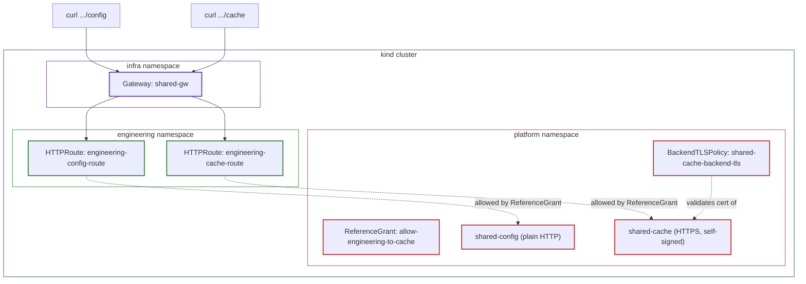

# Lab 4: ReferenceGrant and BackendTLSPolicy, Hands-On

This lab is the hands-on companion to [Part 4: ReferenceGrant and BackendTLSPolicy](../04-referencegrant-and-backendtlspolicy.md). It continues directly from [Lab 2](02-gatewayclass-gateway-lab.md), on the same cluster.

## The two use cases, kept separate on purpose

Both resources are about security, but for two completely different problems, so this lab demonstrates them one at a time, with two separate backends, rather than mixing them together.

`ReferenceGrant` solves a namespace-boundary problem: by default, a Route in one namespace can't send traffic to a Service in another namespace. `BackendTLSPolicy` solves a different problem entirely: it tells the Gateway how to trust the certificate a backend presents when the Gateway re-encrypts traffic on its way to that backend.

## Architecture



## Part 1: ReferenceGrant

Here's the full picture of what this part builds. A brand new namespace, `platform`, will hold a shared backend service. Engineering will then create an `HTTPRoute` that points at this Service, even though it lives in a completely different namespace, something that's rejected by default, as covered in Part 1. A `ReferenceGrant`, created by the owner of the `platform` namespace, is what makes this cross-namespace reference allowed.

Four things get created, in order: the `platform` namespace itself, a simple backend running inside it, the `ReferenceGrant` that permits Engineering to reference that backend, and finally Engineering's own `HTTPRoute` that actually uses it.

### Step 1: Chihiro's step, create the platform namespace

```bash
kubectl create namespace platform
```

### Step 2: Ana's step, deploy a simple backend

```bash
cat <<EOF | kubectl apply -f -
apiVersion: apps/v1
kind: Deployment
metadata:
  name: shared-config
  namespace: platform
spec:
  replicas: 1
  selector:
    matchLabels:
      app: shared-config
  template:
    metadata:
      labels:
        app: shared-config
    spec:
      containers:
        - name: http-echo
          image: hashicorp/http-echo:1.0.0
          args:
            - "-text=Hello from Platform's shared config service"
---
apiVersion: v1
kind: Service
metadata:
  name: shared-config
  namespace: platform
spec:
  selector:
    app: shared-config
  ports:
    - port: 8080
      targetPort: 5678
EOF
```

This creates a Deployment and a Service, the same pattern used for every backend throughout this series.

### Step 3: Ana's step, create the ReferenceGrant

This ReferenceGrant goes in the `platform` namespace. Not in `engineering`. Here's why: `platform` is being referenced. `engineering` is the one doing the referencing. The grant always goes with the one being referenced.

```bash
cat <<EOF | kubectl apply -f -
apiVersion: gateway.networking.k8s.io/v1beta1
kind: ReferenceGrant
metadata:
  name: allow-engineering-to-cache
  namespace: platform
spec:
  from:
    - group: gateway.networking.k8s.io
      kind: HTTPRoute
      namespace: engineering
  to:
    - group: ""
      kind: Service
EOF
```

Leaving out `name` under `to` allows this grant to cover any Service in the `platform` namespace, not just one specific one, this is used again later in this lab.

### Step 4: Ana's step, create the cross-namespace HTTPRoute

This one goes in the `engineering` namespace, not `platform`. The Route itself stays with the team that owns it, only the backend it points to lives elsewhere.

```bash
cat <<EOF | kubectl apply -f -
apiVersion: gateway.networking.k8s.io/v1
kind: HTTPRoute
metadata:
  name: engineering-config-route
  namespace: engineering
spec:
  parentRefs:
    - name: shared-gw
      namespace: infra
      sectionName: engineering-https
  hostnames:
    - "engineering.example.com"
  rules:
    - matches:
        - path:
            value: /config
      backendRefs:
        - name: shared-config
          namespace: platform
          port: 8080
EOF
```

Notice `backendRefs` explicitly names `namespace: platform`, this is what makes it a cross-namespace reference in the first place.

### Step 5: Test it

```bash
kubectl port-forward -n envoy-gateway-system svc/envoy-infra-shared-gw-201b3ab5 8443:443
```

```bash
curl -k --resolve engineering.example.com:8443:127.0.0.1 https://engineering.example.com:8443/config
```

```
Hello from Platform's shared config service
```

Without the `ReferenceGrant`, this same `HTTPRoute` would have been rejected before hostname or path matching ever came into play. This test used a plain HTTP backend on purpose, to demonstrate `ReferenceGrant` on its own, without any TLS complexity mixed in.

## Part 2: BackendTLSPolicy

Here's what this part builds, and why. A second backend, `shared-cache`, gets added to the same `platform` namespace, this one deliberately serves HTTPS only, on its own certificate, to create a real mismatch with `engineering-https`'s `Terminate` mode, which decrypts client traffic and forwards it as plain HTTP. That mismatch will cause a real failure, on purpose, then get fixed step by step with `BackendTLSPolicy`, so each field's actual purpose becomes clear from what breaks without it.

### Step 1: Ana's step, deploy a backend that terminates its own TLS

```bash
cat <<EOF | kubectl apply -f -
apiVersion: apps/v1
kind: Deployment
metadata:
  name: shared-cache
  namespace: platform
spec:
  replicas: 1
  selector:
    matchLabels:
      app: shared-cache
  template:
    metadata:
      labels:
        app: shared-cache
    spec:
      containers:
        - name: http-https-echo
          image: ghcr.io/mendhak/http-https-echo:41
          ports:
            - containerPort: 8443
---
apiVersion: v1
kind: Service
metadata:
  name: shared-cache
  namespace: platform
spec:
  selector:
    app: shared-cache
  ports:
    - name: https
      port: 8443
      targetPort: 8443
EOF
```

Notice the Service's port has a `name` (`https`) this time, not just a number. This matters later.

### Step 2: Ana's step, create the matching HTTPRoute

The same `ReferenceGrant` from Part 1 already covers this Service too, since it wasn't limited to one specific name.

```bash
cat <<EOF | kubectl apply -f -
apiVersion: gateway.networking.k8s.io/v1
kind: HTTPRoute
metadata:
  name: engineering-cache-route
  namespace: engineering
spec:
  parentRefs:
    - name: shared-gw
      namespace: infra
      sectionName: engineering-https
  hostnames:
    - "engineering.example.com"
  rules:
    - matches:
        - path:
            value: /cache
      backendRefs:
        - name: shared-cache
          namespace: platform
          port: 8443
EOF
```

### Step 3: The first attempt fails, as expected

```bash
curl -k --resolve engineering.example.com:8443:127.0.0.1 https://engineering.example.com:8443/cache
```

```
upstream connect error or disconnect/reset before headers. reset reason: connection termination
```

The `engineering-https` Listener is in `Terminate` mode, meaning it decrypts client traffic, then forwards it to the backend as plain HTTP. But `shared-cache`'s port only speaks HTTPS. This confirmed by checking the backend's certificate directly:

```bash
kubectl run tls-check --rm -it --image=alpine --restart=Never -- sh -c "apk add --no-cache openssl -q && echo | openssl s_client -connect shared-cache.platform.svc.cluster.local:8443 2>&1 | tail -10"
```

The handshake succeeds when connecting directly with TLS, confirming the backend genuinely only accepts HTTPS on this port. This is exactly the situation `BackendTLSPolicy` is for.

### Step 4: First fix attempt, wellKnownCACertificates, still fails

```bash
cat <<EOF | kubectl apply -f -
apiVersion: gateway.networking.k8s.io/v1
kind: BackendTLSPolicy
metadata:
  name: shared-cache-backend-tls
  namespace: platform
spec:
  targetRefs:
    - group: ""
      kind: Service
      name: shared-cache
  validation:
    hostname: shared-cache.platform.svc.cluster.local
    wellKnownCACertificates: System
EOF
```

```bash
curl -k --resolve engineering.example.com:8443:127.0.0.1 https://engineering.example.com:8443/cache
```

```
upstream connect error or disconnect/reset before headers. reset reason: remote connection failure
```

The error changed, Envoy is now attempting TLS to the backend (progress), but the handshake itself fails. `wellKnownCACertificates: System` only trusts public certificate authorities, and this backend's certificate is self-signed, so it isn't trusted this way.

### Step 5: Second fix attempt, the right CA but the wrong hostname

Fetch the backend's actual certificate:

```bash
kubectl run cert-fetch --rm -i --image=alpine --restart=Never -- sh -c "apk add --no-cache openssl -q && echo | openssl s_client -connect shared-cache.platform.svc.cluster.local:8443 -showcerts 2>/dev/null | sed -n '/-----BEGIN CERTIFICATE-----/,/-----END CERTIFICATE-----/p'" > shared-cache-ca.crt
```

Load it as a ConfigMap. `caCertificateRefs` only has official, guaranteed ("Core") support for `ConfigMap`, `Secret` support varies by implementation and is rejected outright by some, so `ConfigMap` is the safe choice:

```bash
kubectl create configmap shared-cache-ca --from-file=ca.crt=shared-cache-ca.crt -n platform
```

```bash
cat <<EOF | kubectl apply -f -
apiVersion: gateway.networking.k8s.io/v1
kind: BackendTLSPolicy
metadata:
  name: shared-cache-backend-tls
  namespace: platform
spec:
  targetRefs:
    - group: ""
      kind: Service
      name: shared-cache
  validation:
    hostname: shared-cache.platform.svc.cluster.local
    caCertificateRefs:
      - group: ""
        kind: ConfigMap
        name: shared-cache-ca
EOF
```

```bash
curl -k --resolve engineering.example.com:8443:127.0.0.1 https://engineering.example.com:8443/cache
```

Still the same `remote connection failure`. Checking the certificate's actual Subject Alternative Names explains why:

```bash
kubectl run cert-check --rm -i --image=alpine --restart=Never -- sh -c "apk add --no-cache openssl -q && echo | openssl s_client -connect shared-cache.platform.svc.cluster.local:8443 2>/dev/null | openssl x509 -noout -text | grep -A2 'Subject Alternative Name'"
```

```
X509v3 Subject Alternative Name:
    DNS:my.example.com, DNS:my.example.net, IP Address:192.168.50.108, IP Address:127.0.0.1
```

This test image ships with a fixed, hardcoded certificate, valid only for `my.example.com`, regardless of where it's actually deployed. The `hostname` field in `BackendTLSPolicy` has to match what's on the certificate, not the Service's own DNS name.

### Step 6: Third fix attempt, the right hostname, still fails

```bash
cat <<EOF | kubectl apply -f -
apiVersion: gateway.networking.k8s.io/v1
kind: BackendTLSPolicy
metadata:
  name: shared-cache-backend-tls
  namespace: platform
spec:
  targetRefs:
    - group: ""
      kind: Service
      name: shared-cache
  validation:
    hostname: my.example.com
    caCertificateRefs:
      - group: ""
        kind: ConfigMap
        name: shared-cache-ca
EOF
```

Same `remote connection failure` again. The official Envoy Gateway documentation's own example for this exact scenario includes one more field that was missing here: `sectionName`, referencing the Service's port **by name**, not just by number.

### Step 7: The actual fix, sectionName

```bash
cat <<EOF | kubectl apply -f -
apiVersion: gateway.networking.k8s.io/v1
kind: BackendTLSPolicy
metadata:
  name: shared-cache-backend-tls
  namespace: platform
spec:
  targetRefs:
    - group: ""
      kind: Service
      name: shared-cache
      sectionName: https
  validation:
    hostname: my.example.com
    caCertificateRefs:
      - group: ""
        kind: ConfigMap
        name: shared-cache-ca
EOF
```

```bash
curl -k --resolve engineering.example.com:8443:127.0.0.1 https://engineering.example.com:8443/cache
```

```json
{
  "protocol": "https",
  "connection": {
    "servername": "my.example.com"
  },
  "os": {
    "hostname": "shared-cache-6f6455b87b-cpzt9"
  }
}
```

Three things this response confirms: `"os": {"hostname": "shared-cache-..."}` shows the response genuinely came from the backend Pod, `"connection": {"servername": "my.example.com"}` shows the Gateway presented the exact SNI the `BackendTLSPolicy` specified, and `"protocol": "https"` confirms the connection to the backend stayed encrypted the whole way.

### What this debugging journey shows

Getting `BackendTLSPolicy` working correctly took five attempts, each one fixing a genuine, separate mistake:

1. No policy at all, plain HTTP sent to an HTTPS-only port, immediate reset
2. `wellKnownCACertificates: System`, rejected because the certificate is self-signed
3. The right CA, wrong `hostname` (used the Service's own name instead of what's on the certificate)
4. The right `hostname`, but no `sectionName` to identify which named port on the Service to apply this to
5. Adding `sectionName`, success

None of these were guessed, each was diagnosed by checking the actual certificate, the actual error message, or the official documentation's own worked example, before making the next change.

## Who did what, mapped to the personas

| Step | Task | Persona |
|---|---|---|
| Part 1, Step 1 | Create the `platform` namespace | Chihiro |
| Part 1, Step 2 | Deploy the config backend | Ana |
| Part 1, Step 3 | Create the ReferenceGrant | Ana (owns the `shared-config` Service) |
| Part 1, Step 4 | Create the cross-namespace HTTPRoute | Ana (engineering team) |
| Part 2, Step 1 | Deploy the cache backend | Ana |
| Part 2, Step 2 | Create the matching HTTPRoute | Ana (engineering team) |
| Part 2, Step 4-7 | Create and fix the BackendTLSPolicy | Ana (owns the `shared-cache` Service) |

## Cleanup

```bash
kind delete cluster --name gwapi-lab-1
```
