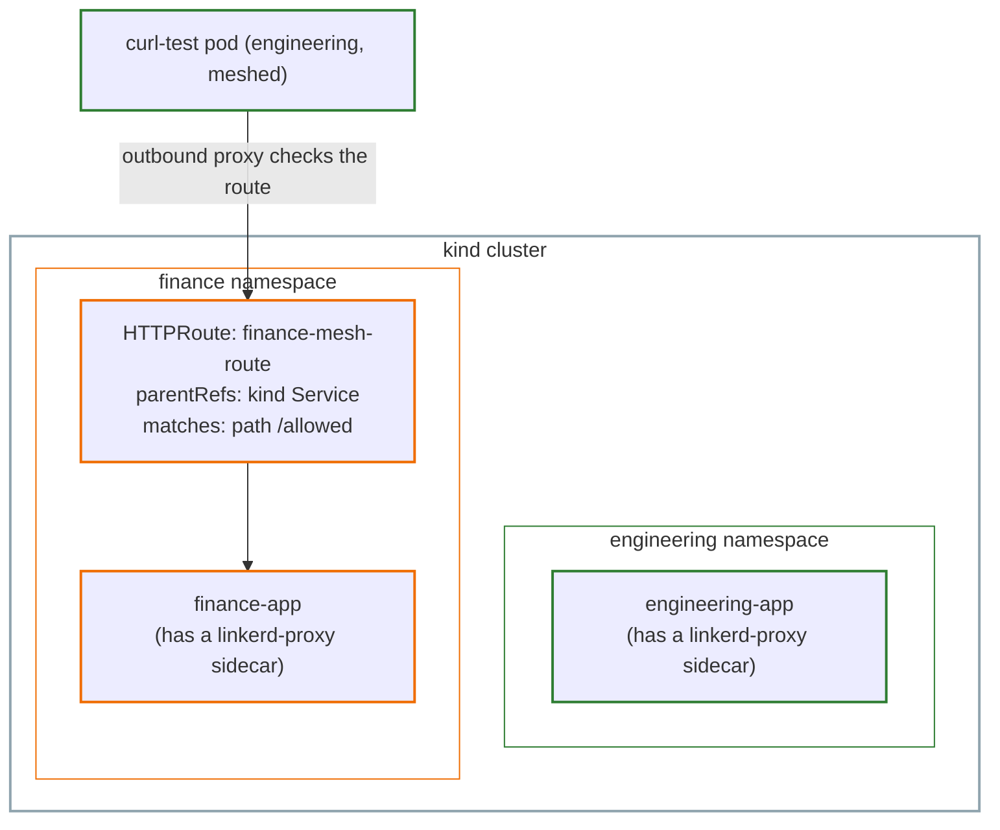

# Lab 5: Service Mesh and GAMMA, Hands-On

This lab is the hands-on companion to [Part 5: Service Mesh and GAMMA](../05-service-mesh-and-gamma.md). It continues from [Lab 2](02-gatewayclass-gateway-lab.md), on the same cluster, and introduces a genuinely new piece of infrastructure: a real service mesh.

## The use case

Everything so far in this series has been north-south traffic, a client outside the cluster, talking to something inside it. This lab tests Part 5's central claim directly: that the exact same `HTTPRoute` resource, unchanged, can also govern east-west traffic, service to service, entirely inside the cluster, as long as its `parentRefs` points to a `Service` instead of a `Gateway`.

`Envoy Gateway`, the controller used throughout this series, is built for north-south traffic. It does not implement GAMMA. Demonstrating east-west routing needs a separate, dedicated service mesh, installed alongside it. Of the GAMMA-conformant options (Istio, Linkerd, Cilium), this lab uses Linkerd, since it installs quickly and doesn't require replacing the cluster's CNI, unlike Cilium.

## Architecture



## Step 1: Install the Linkerd CLI

```bash
brew install linkerd
```

This only installs a command-line tool on your own machine, the same way `kubectl` does, it doesn't put anything into the cluster yet.

```bash
linkerd check --pre
```

This checks the cluster is ready for Linkerd, before installing anything.

## Step 2: Install Linkerd's CRDs

```bash
linkerd install --crds | kubectl apply -f -
```

This generates a YAML manifest and pipes it straight to `kubectl apply`, the actual install step. A worthwhile detail here: Linkerd defines its own `HTTPRoute` CRD, under the `policy.linkerd.io` group, separate from the official `gateway.networking.k8s.io` one already installed by Envoy Gateway. Since the official Gateway API CRDs already existed on this cluster, Linkerd's installer detected that and didn't attempt to duplicate them, only its own, separate resources were created. Linkerd's own documentation confirms new installations should generally use the official `gateway.networking.k8s.io` HTTPRoute, which is what this lab does throughout.

## Step 3: Install the control plane

```bash
linkerd install | kubectl apply -f -
```

This is the step that actually deploys Linkerd, a new `linkerd` namespace, with its own control-plane Pods.

```bash
linkerd check
```

```
Status check results are √
```

## Step 4: Add Engineering and Finance to the mesh

Being in the `linkerd` namespace doesn't automatically mesh anything else. Each namespace needs to opt in.

```bash
kubectl annotate namespace engineering linkerd.io/inject=enabled
kubectl rollout restart deployment engineering-app -n engineering
```

```bash
kubectl annotate namespace finance linkerd.io/inject=enabled
kubectl rollout restart deployment finance-app -n finance
```

```bash
kubectl get pods -n engineering -l app=engineering-app
kubectl get pods -n finance -l app=finance-app
```

```
engineering-app-58f46c5966-gwnfq   2/2     Running
finance-app-5f98f6cd7b-fk4lb       2/2     Running
```

`READY: 2/2` is the signal to look for, not `1/1`. This confirms a `linkerd-proxy` sidecar was added. Note this doesn't show up under `spec.containers`, current Linkerd versions register the proxy as a native sidecar, under `spec.initContainers`, with its own `restartPolicy: Always` so it runs for the Pod's entire lifetime rather than exiting early like a normal init container.

## Step 5: The GAMMA HTTPRoute itself

```bash
cat <<EOF | kubectl apply -f -
apiVersion: gateway.networking.k8s.io/v1
kind: HTTPRoute
metadata:
  name: finance-mesh-route
  namespace: finance
spec:
  parentRefs:
    - name: finance-app
      kind: Service
      group: ""
  rules:
    - matches:
        - path:
            type: Exact
            value: /allowed
      backendRefs:
        - name: finance-app
          port: 8080
EOF
```

The only thing that distinguishes this from every north-south `HTTPRoute` earlier in this series is `parentRefs`, it names a `Service`, not a `Gateway`.

```bash
kubectl describe httproute finance-mesh-route -n finance
```

```
controllerName: linkerd.io/policy-controller
```

This one line confirms GAMMA is genuinely working. This Route wasn't accepted by Envoy Gateway, it was accepted and is now being enforced by Linkerd, since a `Service`-parented `HTTPRoute` falls squarely inside the mesh's territory, not the Gateway controller's.

## Step 6: Test it, from inside the mesh

```bash
kubectl run curl-test -n engineering --image=curlimages/curl --restart=Never -- sleep 3600
```

Because `engineering`'s namespace is already annotated for injection, this new Pod is meshed automatically too, no extra step needed.

```bash
kubectl exec -n engineering curl-test -c curl-test -- curl -s -o /dev/null -w "%{http_code}\n" http://finance-app.finance.svc.cluster.local:8080/allowed
```

```
200
```

```bash
kubectl exec -n engineering curl-test -c curl-test -- curl -s -o /dev/null -w "%{http_code}\n" http://finance-app.finance.svc.cluster.local:8080/blocked
```

```
404
```

`/allowed` matches the Route's rule and reaches `finance-app`. `/blocked` matches nothing, and gets rejected, exactly as Part 5 describes: "when one or more Routes are attached to a Service, requests that do not match at least one of the Routes will be rejected."

## Step 7: Confirm it with the proxy's own metrics

HTTP status codes alone are good evidence, but Linkerd's proxies also expose metrics tied directly to the specific `HTTPRoute` object responsible, which is worth capturing as concrete, independent proof.

```bash
linkerd diagnostics proxy-metrics -n engineering po/curl-test | grep "route_name=\"finance-mesh-route\""
```

```
outbound_http_route_request_statuses_total{...,route_namespace="finance",route_name="finance-mesh-route",...,http_status="200",...} 1
```

This metric comes from `curl-test`'s own proxy. It names `finance-mesh-route` by name. That's the proof: the `200` we saw is tied to this exact `HTTPRoute`, not just a guess that "something in the mesh must be working."

Notice the `/blocked` request doesn't show up here at all. That's expected. It never matched any route, so there's no route to attach that number to.

## Who did what, mapped to the personas

| Step | Task | Persona |
|---|---|---|
| Step 1-3 | Install Linkerd (CLI, CRDs, control plane) | Ian |
| Step 4 | Add namespaces to the mesh | Chihiro |
| Step 5 | Create the GAMMA HTTPRoute | Ana |
| Step 6 | Test from a Pod inside the mesh | Ana |

## Cleanup

```bash
kind delete cluster --name gwapi-lab-1
```
