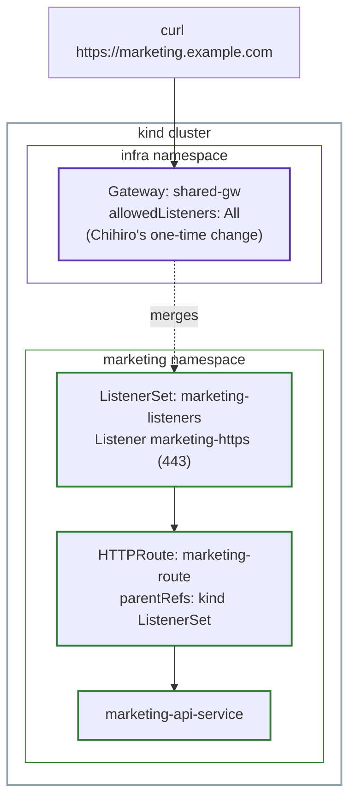

# Lab 6: ListenerSet, Hands-On

This lab is the hands-on companion to [Part 6: ListenerSet](../06-listenerset.md). It continues directly from [Lab 2](02-gatewayclass-gateway-lab.md), on the same cluster, where Chihiro's `shared-gw` already carries listeners for Engineering and Finance.

## The use case

Every time a new team wants their own domain on `shared-gw`, Chihiro has had to edit the Gateway directly. This works for two teams, but it doesn't scale, Chihiro becomes a bottleneck as more teams join. This lab introduces a third team, Marketing, and gives them their own domain without Chihiro touching `shared-gw` again.

## Architecture



Notice everything Marketing needs, the `ListenerSet`, the `HTTPRoute`, the certificate Secret, lives entirely inside the `marketing` namespace. Nothing here touches `infra`.

## Step 1: Chihiro's step, allow ListenerSets, once

```bash
cat <<EOF | kubectl apply -f -
apiVersion: gateway.networking.k8s.io/v1
kind: Gateway
metadata:
  name: shared-gw
  namespace: infra
spec:
  gatewayClassName: eg
  allowedListeners:
    namespaces:
      from: All
  listeners:
    - name: http
      protocol: HTTP
      port: 80
      allowedRoutes:
        namespaces:
          from: All
    - name: engineering-https
      protocol: HTTPS
      port: 443
      hostname: "engineering.example.com"
      tls:
        mode: Terminate
        certificateRefs:
          - name: engineering-tls-secret
      allowedRoutes:
        namespaces:
          from: All
    - name: finance-https
      protocol: HTTPS
      port: 443
      hostname: "finance.example.com"
      tls:
        mode: Terminate
        certificateRefs:
          - name: finance-tls-secret
      allowedRoutes:
        namespaces:
          from: All
EOF
```

```bash
kubectl get gateway shared-gw -n infra
```

```
NAME        CLASS   PROGRAMMED   AGE
shared-gw   eg      True         21h
```

`allowedListeners.namespaces.from: All` is the only new field. By default, a `Gateway` doesn't allow any `ListenerSet` to attach at all, this one field is Chihiro's entire, one-time contribution to this lab.

## Step 2: Ana's step, deploy Marketing's backend

```bash
kubectl create namespace marketing
```

```bash
cat <<EOF | kubectl apply -f -
apiVersion: apps/v1
kind: Deployment
metadata:
  name: marketing-api-service
  namespace: marketing
spec:
  replicas: 1
  selector:
    matchLabels:
      app: marketing-api-service
  template:
    metadata:
      labels:
        app: marketing-api-service
    spec:
      containers:
        - name: http-echo
          image: hashicorp/http-echo:1.0.0
          args:
            - "-text=Hello from Marketing"
---
apiVersion: v1
kind: Service
metadata:
  name: marketing-api-service
  namespace: marketing
spec:
  selector:
    app: marketing-api-service
  ports:
    - port: 8080
      targetPort: 5678
EOF
```

## Step 3: Ana's step, generate a certificate and create the Secret in Marketing's own namespace

```bash
openssl req -x509 -newkey rsa:2048 -nodes -keyout marketing.key -out marketing.crt -days 365 -subj "/CN=marketing.example.com"
```

```bash
kubectl create secret tls marketing-tls-secret --cert=marketing.crt --key=marketing.key -n marketing
```

```
secret/marketing-tls-secret created
```

Unlike Lab 2, where Engineering's and Finance's certificates had to live in `infra` (the Gateway's namespace), this one stays in `marketing`. A `ListenerSet` can reference a Secret in its own namespace directly, no `ReferenceGrant` needed, since it isn't the Gateway itself doing the referencing.

## Step 4: Ana's step, create the ListenerSet

```bash
cat <<EOF | kubectl apply -f -
apiVersion: gateway.networking.k8s.io/v1
kind: ListenerSet
metadata:
  name: marketing-listeners
  namespace: marketing
spec:
  parentRef:
    name: shared-gw
    kind: Gateway
    group: gateway.networking.k8s.io
    namespace: infra
  listeners:
    - name: marketing-https
      protocol: HTTPS
      port: 443
      hostname: "marketing.example.com"
      tls:
        mode: Terminate
        certificateRefs:
          - name: marketing-tls-secret
EOF
```

```bash
kubectl describe listenerset marketing-listeners -n marketing
```

The relevant part of the output:

```
Status:
  Conditions:
    Reason:  Accepted
    Status:  True
    Reason:  Programmed
    Status:  True
  Listeners:
    Attached Routes:  0
    Conditions:
      Reason: Conflicted
      Status: False (NoConflicts)
    Name: marketing-https
    Supported Kinds:
      Kind: HTTPRoute
      Kind: GRPCRoute
```

`Attached Routes: 0` is expected here, no Route targets this Listener yet. `Conflicted: False` confirms `marketing.example.com` doesn't collide with anything already on `shared-gw`. Notice `Supported Kinds` lists `HTTPRoute` and `GRPCRoute`, not `TLSRoute`, since this Listener uses `protocol: HTTPS` with `mode: Terminate`, the same rule from Part 2 that decides which Route kind is compatible, regardless of whether the Listener lives on a `Gateway` or a `ListenerSet`.

## Step 5: Ana's step, create the HTTPRoute

```bash
cat <<EOF | kubectl apply -f -
apiVersion: gateway.networking.k8s.io/v1
kind: HTTPRoute
metadata:
  name: marketing-route
  namespace: marketing
spec:
  parentRefs:
    - name: marketing-listeners
      kind: ListenerSet
      group: gateway.networking.k8s.io
  hostnames:
    - "marketing.example.com"
  rules:
    - backendRefs:
        - name: marketing-api-service
          port: 8080
EOF
```

Notice `parentRefs.kind: ListenerSet`, not `Gateway`. This is the only real syntax difference from every `HTTPRoute` in earlier labs.

Checking again confirms the Route attached:

```bash
kubectl describe listenerset marketing-listeners -n marketing
```

```
Attached Routes:  1
```

## Step 6: Test it

```bash
kubectl port-forward -n envoy-gateway-system svc/envoy-infra-shared-gw-201b3ab5 8443:443
```

```bash
curl -k --resolve marketing.example.com:8443:127.0.0.1 https://marketing.example.com:8443/
```

```
Hello from Marketing
```

Marketing's domain is live. Chihiro was never involved past Step 1.

## End-to-end request flow

For `curl -k --resolve marketing.example.com:8443:127.0.0.1 https://marketing.example.com:8443/`:

1. The request reaches `shared-gw`. By this point, `shared-gw`'s own listeners (`http`, `engineering-https`, `finance-https`) and `marketing-listeners`'s listener (`marketing-https`) have already been merged into one combined list, this happened the moment `marketing-listeners` was created, well before this request.
2. SNI (`marketing.example.com`) selects `marketing-https` from that combined list, the same mechanism from Lab 2.
3. `marketing-https` decrypts the traffic using `marketing-tls-secret`, and confirms the Host header.
4. `marketing-route`, attached to `marketing-listeners`, matches on hostname.
5. The request is forwarded to `marketing-api-service`.

From the request's point of view, there is no difference between a Listener defined directly on `shared-gw` and one defined on an attached `ListenerSet`. The only place the difference shows up is in who had to do the work to create it.

## Who did what, mapped to the personas

| Step | Task | Persona |
|---|---|---|
| Step 1 | Allow ListenerSets on `shared-gw`, once | Chihiro |
| Step 2 | Deploy the backend | Ana |
| Step 3 | Generate the certificate, create the Secret | Ana |
| Step 4 | Create the ListenerSet | Ana |
| Step 5 | Create the HTTPRoute | Ana |

Compare this to Lab 2's table: there, Chihiro was involved in every step for a new domain. Here, Chihiro appears exactly once, for the entire lab, and that single step already covers every future team that wants to self-serve the same way.

## Cleanup

```bash
kind delete cluster --name gwapi-lab-1
```
